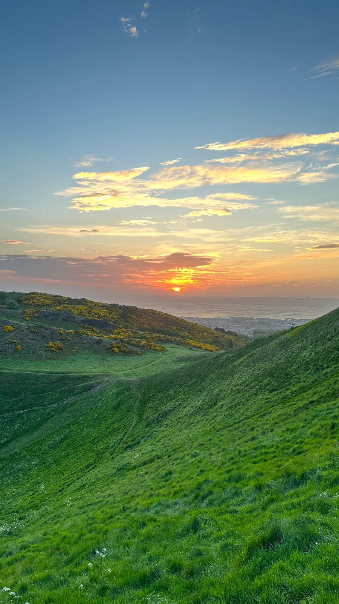
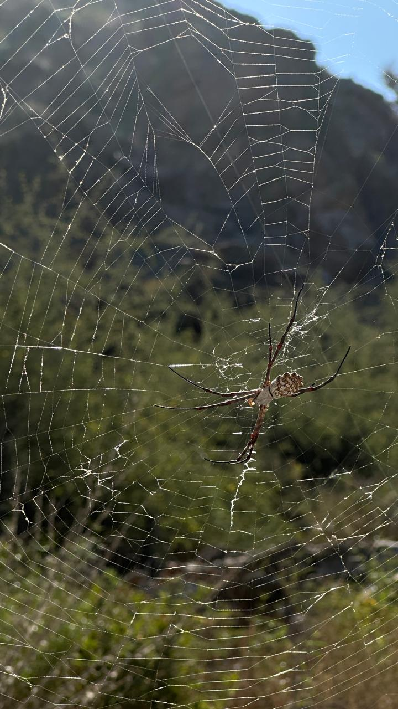
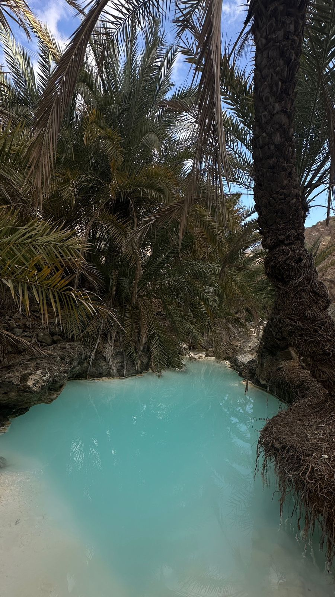
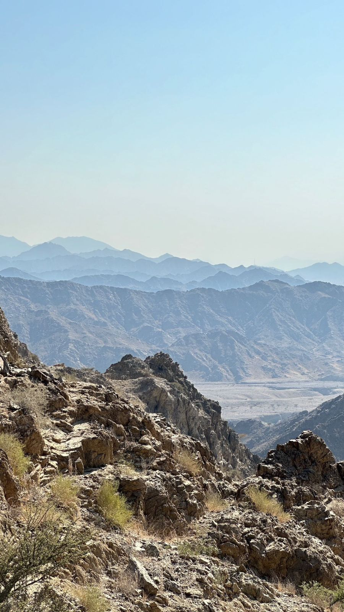

[//]: <> (Ibrahim Aldarmaki)

[//]: #
[//]:

[//]:     
[//]:

[//]: #
[//]:#

[//]:#!kjhk[CV](https://github.com/i-aldarmaki/personal_website/blob/f7ddeb0e8637c0f228f162829755e307e26ad6b0/file/Ibrahim_Resume_2024_April.pdf)[GitHub](https://github.com/i-aldarmaki)

     

    <h1 align="center">Ibrahim Aldarmaki</h1>

    <a href="mailto:ibrahim.m.aldarmaki@outlook.com">Email</a>
    <a href="file/Ibrahim_Resume_2024_April.pdf">CV</a>
    <a href="https://github.com/i-aldarmaki">GitHub</a>

***
### About:
Hi! I am a Research Assistant at Khalifa University. I am currently researching and developing machine learning and signal processing algorithms for real-time, low-latency Wi-Fi sensing applications in healthcare.

I am broadly interested in signal processing and machine learning. My previous work was mainly in signal, audio, and speech processing, neural architectures, and time-series analysis. I enjoy exploring multidisciplinary problems, such as a recent work in portfolio optimization.

I was recently a researcher at Mohamed bin Zayed University of Artificial Intelligence (MBZUAI). During my time at MBZUAI, I worked/collaborated with 
[Prof. Thamar Solorio](https://mbzuai.ac.ae/study/faculty/thamar-solorio/), 
[Prof. Bhiksha Raj](https://cmu-mlsp.github.io/team/bhiksha_raj), and 
[Dr. Hanan Aldarmaki](https://mbzuai.ac.ae/study/faculty/hanan-al-darmaki/)
. Prior to that, I received my bachelors in Electronics and Electrical Engineering (EEE) at the University of Edinburgh, where I worked on my thesis at the 
[Insitute for Data, Imaging, and Communications (IDCOM)](https://www.eng.ed.ac.uk/research/institutes/idcom). 
I previously worked in planetary and atmospheric physics at [Mohammed Bin Rashid Space Centre (MBRSC)](https://www.mbrsc.ae/) as a space scientists within the [Emirates Mars Mission](https://www.emiratesmarsmission.ae/) science team. 

For a more detailed description of my background and experience, please refer to my [CV](file/Ibrahim_Resume_2024_April.pdf). (Last updated: December 2024)

***
### News:
- [Sep. 2024] First-Author Submission of "RelUNet: Relative Channel Fusion U-Net for Multichannel Speech Enhancement" avialable on ArXiv.
- [Sep. 2024] Selected for Al Nokhba Program and Joined Khalifa University as a Researcher.
- [Apr. 2024] Started my national service.
- [Dec. 2023] Joined Mohammed Bin Zayed University of Artificial Intelligence (MBZUAI) as a Researcher.
- [Jul. 2023] Graduated with a BEng in Electronics and Electrical Engineering from The University of Edinburgh.

***
### Publications:
**RelUNet: Relative Channel Fusion U-Net for Multichannel Speech Enhancement**\
**Ibrahim Aldarmaki**, Thamar Solorio, Bhiksha Raj, Hanan Aldarmaki\
 arXiv:2410.05019, 2024 \
[[HTML](https://arxiv.org/html/2410.05019v1)] [[PDF](https://arxiv.org/pdf/2410.05019)] [[arXiv](https://arxiv.org/abs/2410.05019)]

***
### Open-Source Projects:
* C(ube)ARnival (Augmented Reality) \| [Jupyter Notebook](https://github.com/i-aldarmaki/CubeARnival/blob/main/CubeARnival_chessboard.ipynb)
* Navigating Through The Unknown (Kalman Filter) \| [Jupyter Notebook](https://github.com/i-aldarmaki/Navigating-Through-the-Unknown/blob/main/Navigating_Through_The_Unknown.ipynb)
* Deep Neural Networks for Direction of Arrival Estimation using Circular Microphone Arrays (BEng Thesis) \| [Thesis](file/BEng_Thesis_Ibrahim_Aldarmaki.pdf)
* Social Media Reviews Sentiment Analysis (Course Project) \| [Report](file/DAML4_CW2.pdf)

***
### Miscellaneous:
* Erdös Number: 4
* Hikes:

      
     
     
     

